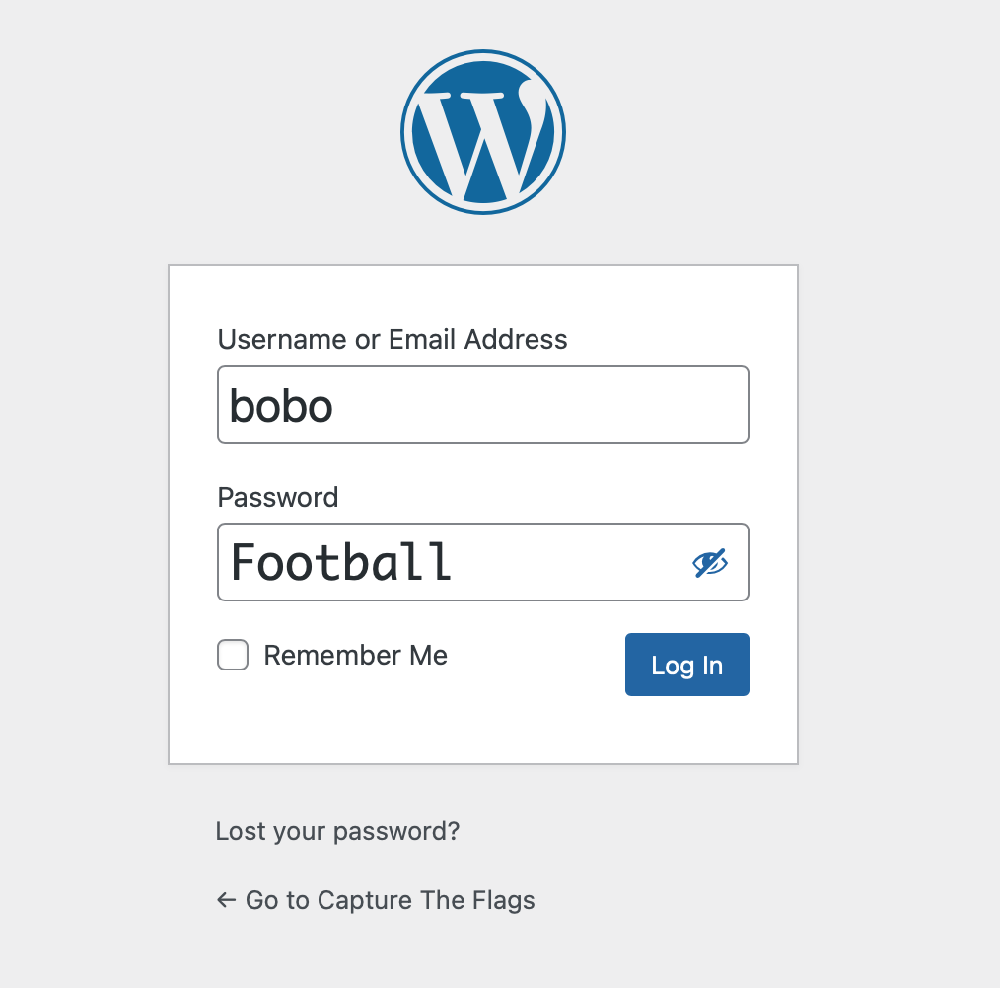

# 2025 CTF Report from Team 22

- Chris Talavera
- Jackson Xu
- Joel Han
- Yucheng Zhang

## Unsolved challenges:

- Challenge 4: All your base64 are belong to us.

- Challenge 9: Buried in the dump, redux: needle in the haystack.

- Challenge 13: LOLCAP.

- Challenge 14: notuber.

## Two VERY useful tools used in vulnerability scan

### Gobuster: Find hidden files and web directories

Gobuster helped us solve several challenges by finding hidden files and directories that we couldn’t see just by browsing the site.
Before we explain how we solved each challenge, we’ll first show Gobuster outputs. These gave us clues like secret admin pages, robots.txt, .git, and cs40 homeworks that led us to the flags.

```
gobuster dir -u http://3.145.206.165 -w /usr/share/wordlists/dirbuster/directory-list-2.3-medium.txt -x php,html,js,json,txt
===============================================================
Gobuster v3.6
by OJ Reeves (@TheColonial) & Christian Mehlmauer (@firefart)
===============================================================
[+] Url:                     http://3.145.206.165
[+] Method:                  GET
[+] Threads:                 10
[+] Wordlist:                /usr/share/wordlists/dirbuster/directory-list-2.3-medium.txt
[+] Negative Status codes:   404
[+] User Agent:              gobuster/3.6
[+] Extensions:              php,html,js,json,txt
[+] Timeout:                 10s
===============================================================
Starting gobuster in directory enumeration mode
===============================================================
/index.php            (Status: 301) [Size: 0] [--> http://3.145.206.165/]
/login.php            (Status: 302) [Size: 0] [--> admin.php?error]
/main.php             (Status: 302) [Size: 0] [--> admin.php]
/data.txt             (Status: 200) [Size: 200701]
/wp-content           (Status: 301) [Size: 169] [--> http://3.145.206.165/wp-content/]
/admin.php            (Status: 200) [Size: 472]
/board.php            (Status: 200) [Size: 1597]
/wp-login.php         (Status: 200) [Size: 5016]
/includes             (Status: 301) [Size: 169] [--> http://3.145.206.165/includes/]
/license.txt          (Status: 200) [Size: 19915]
/wp-includes          (Status: 301) [Size: 169] [--> http://3.145.206.165/wp-includes/]
/logout.php           (Status: 302) [Size: 0] [--> admin.php]
/readme.html          (Status: 200) [Size: 7466]
/robots.txt           (Status: 200) [Size: 8135]
/wp-trackback.php     (Status: 200) [Size: 135]
/scoreboard           (Status: 301) [Size: 169] [--> http://3.145.206.165/scoreboard/]
/wp-admin             (Status: 301) [Size: 169] [--> http://3.145.206.165/wp-admin/]
/xmlrpc.php           (Status: 405) [Size: 42]
/logger.php           (Status: 200) [Size: 99]
/wp-signup.php        (Status: 302) [Size: 0] [--> /wp-login.php?action=register]
Progress: 1323360 / 1323366 (100.00%)
===============================================================
Finished
===============================================================
```

### WPScan: WordPress Security Scanner

wpscan is a WordPress vulnerability scanner — it’s a command-line tool used to scan WordPress websites for known security issues.
We first used WPScan to scan the server to identify vulnerabilities.

```
$ wpscan --url http://3.145.206.16
Interesting Finding(s):

[+] Headers
 | Interesting Entry: Server: nginx/1.22.1
 | Found By:
 | Confidence: 100%

[+] robots.txt found: http://3.145.206.165/robots.txt
 | Found By:
 | Confidence: 100%

[+] XML-RPC seems to be enabled: http://3.145.206.165/xmlrpc.php
 | Found By: Direct Access (Aggressive Detection)
 | Confidence: 100%
 | References:
 |  - http://codex.wordpress.org/XML-RPC_Pingback_API
 |  - https://www.rapid7.com/db/modules/auxiliary/scanner/http/wordpress_ghost_scanner/
 |  - https://www.rapid7.com/db/modules/auxiliary/dos/http/wordpress_xmlrpc_dos/
 |  - https://www.rapid7.com/db/modules/auxiliary/scanner/http/wordpress_xmlrpc_login/
 |  - https://www.rapid7.com/db/modules/auxiliary/scanner/http/wordpress_pingback_access/

[+] WordPress readme found: http://3.145.206.165/readme.html
 | Found By: Direct Access (Aggressive Detection)
 | Confidence: 100%

[+] Upload directory has listing enabled: http://3.145.206.165/wp-content/uploads/
 | Found By: Direct Access (Aggressive Detection)
 | Confidence: 100%

[+] The external WP-Cron seems to be enabled: http://3.145.206.165/wp-cron.php
 | Found By: Direct Access (Aggressive Detection)
 | Confidence: 60%
 | References:
 |  - https://www.iplocation.net/defend-wordpress-from-ddos
 |  - https://github.com/wpscanteam/wpscan/issues/1299

[+] WordPress version 6.2 identified (Insecure, released on 2023-03-29).
 | Found By:
 |  - http://3.145.206.165/, Match: 'wp-includes\/js\/wp-emoji-release.min.js?ver=6.2'
 | Confirmed By:
 |  - http://3.145.206.165/, Match: 'WordPress 6.2'
 |
 | [!] 18 vulnerabilities identified:
 |
 | [!] Title: WP <= 6.2 - Unauthenticated Blind SSRF via DNS Rebinding
 |     References:
 |      - https://wpscan.com/vulnerability/c8814e6e-78b3-4f63-a1d3-6906a84c1f11
 |      - https://cve.mitre.org/cgi-bin/cvename.cgi?name=CVE-2022-3590
 |      - https://blog.sonarsource.com/wordpress-core-unauthenticated-blind-ssrf/
 |
 | [!] Title: WP < 6.2.1 - Directory Traversal via Translation Files
 |     Fixed in: 6.2.1
 |     References:
 |      - https://wpscan.com/vulnerability/2999613a-b8c8-4ec0-9164-5dfe63adf6e6
 |      - https://cve.mitre.org/cgi-bin/cvename.cgi?name=CVE-2023-2745
 |      - https://wordpress.org/news/2023/05/wordpress-6-2-1-maintenance-security-release/
 |
 | [!] Title: WP < 6.2.1 - Thumbnail Image Update via CSRF
 |     Fixed in: 6.2.1
 |     References:
 |      - https://wpscan.com/vulnerability/a03d744a-9839-4167-a356-3e7da0f1d532
 |      - https://wordpress.org/news/2023/05/wordpress-6-2-1-maintenance-security-release/
 |
 | [!] Title: WP < 6.2.1 - Contributor+ Stored XSS via Open Embed Auto Discovery
 |     Fixed in: 6.2.1
 |     References:
 |      - https://wpscan.com/vulnerability/3b574451-2852-4789-bc19-d5cc39948db5
 |      - https://wordpress.org/news/2023/05/wordpress-6-2-1-maintenance-security-release/
 |
 | [!] Title: WP < 6.2.2 - Shortcode Execution in User Generated Data
 |     Fixed in: 6.2.2
 |     References:
 |      - https://wpscan.com/vulnerability/ef289d46-ea83-4fa5-b003-0352c690fd89
 |      - https://wordpress.org/news/2023/05/wordpress-6-2-1-maintenance-security-release/
 |      - https://wordpress.org/news/2023/05/wordpress-6-2-2-security-release/
 |
 | [!] Title: WP < 6.2.1 - Contributor+ Content Injection
 |     Fixed in: 6.2.1
 |     References:
 |      - https://wpscan.com/vulnerability/1527ebdb-18bc-4f9d-9c20-8d729a628670
 |      - https://wordpress.org/news/2023/05/wordpress-6-2-1-maintenance-security-release/
 |
 | [!] Title: WP 5.6-6.3.1 - Contributor+ Stored XSS via Navigation Block
 |     Fixed in: 6.2.3
 |     References:
 |      - https://wpscan.com/vulnerability/cd130bb3-8d04-4375-a89a-883af131ed3a
 |      - https://cve.mitre.org/cgi-bin/cvename.cgi?name=CVE-2023-38000
 |      - https://wordpress.org/news/2023/10/wordpress-6-3-2-maintenance-and-security-release/
 |
 | [!] Title: WP 5.6-6.3.1 - Reflected XSS via Application Password Requests
 |     Fixed in: 6.2.3
 |     References:
 |      - https://wpscan.com/vulnerability/da1419cc-d821-42d6-b648-bdb3c70d91f2
 |      - https://wordpress.org/news/2023/10/wordpress-6-3-2-maintenance-and-security-release/
 |
 | [!] Title: WP < 6.3.2 - Denial of Service via Cache Poisoning
 |     Fixed in: 6.2.3
 |     References:
 |      - https://wpscan.com/vulnerability/6d80e09d-34d5-4fda-81cb-e703d0e56e4f
 |      - https://wordpress.org/news/2023/10/wordpress-6-3-2-maintenance-and-security-release/
 |
 | [!] Title: WP < 6.3.2 - Subscriber+ Arbitrary Shortcode Execution
 |     Fixed in: 6.2.3
 |     References:
 |      - https://wpscan.com/vulnerability/3615aea0-90aa-4f9a-9792-078a90af7f59
 |      - https://wordpress.org/news/2023/10/wordpress-6-3-2-maintenance-and-security-release/
 |
 | [!] Title: WP < 6.3.2 - Contributor+ Comment Disclosure
 |     Fixed in: 6.2.3
 |     References:
 |      - https://wpscan.com/vulnerability/d35b2a3d-9b41-4b4f-8e87-1b8ccb370b9f
 |      - https://cve.mitre.org/cgi-bin/cvename.cgi?name=CVE-2023-39999
 |      - https://wordpress.org/news/2023/10/wordpress-6-3-2-maintenance-and-security-release/
 |
 | [!] Title: WP < 6.3.2 - Unauthenticated Post Author Email Disclosure
 |     Fixed in: 6.2.3
 |     References:
 |      - https://wpscan.com/vulnerability/19380917-4c27-4095-abf1-eba6f913b441
 |      - https://cve.mitre.org/cgi-bin/cvename.cgi?name=CVE-2023-5561
 |      - https://wpscan.com/blog/email-leak-oracle-vulnerability-addressed-in-wordpress-6-3-2/
 |      - https://wordpress.org/news/2023/10/wordpress-6-3-2-maintenance-and-security-release/
 |
 | [!] Title: WordPress < 6.4.3 - Deserialization of Untrusted Data
 |     Fixed in: 6.2.4
 |     References:
 |      - https://wpscan.com/vulnerability/5e9804e5-bbd4-4836-a5f0-b4388cc39225
 |      - https://wordpress.org/news/2024/01/wordpress-6-4-3-maintenance-and-security-release/
 |
 | [!] Title: WordPress < 6.4.3 - Admin+ PHP File Upload
 |     Fixed in: 6.2.4
 |     References:
 |      - https://wpscan.com/vulnerability/a8e12fbe-c70b-4078-9015-cf57a05bdd4a
 |      - https://wordpress.org/news/2024/01/wordpress-6-4-3-maintenance-and-security-release/
 |
 | [!] Title: WP < 6.5.2 - Unauthenticated Stored XSS
 |     Fixed in: 6.2.5
 |     References:
 |      - https://wpscan.com/vulnerability/1a5c5df1-57ee-4190-a336-b0266962078f
 |      - https://wordpress.org/news/2024/04/wordpress-6-5-2-maintenance-and-security-release/
 |
 | [!] Title: WordPress < 6.5.5 - Contributor+ Stored XSS in HTML API
 |     Fixed in: 6.2.6
 |     References:
 |      - https://wpscan.com/vulnerability/2c63f136-4c1f-4093-9a8c-5e51f19eae28
 |      - https://wordpress.org/news/2024/06/wordpress-6-5-5/
 |
 | [!] Title: WordPress < 6.5.5 - Contributor+ Stored XSS in Template-Part Block
 |     Fixed in: 6.2.6
 |     References:
 |      - https://wpscan.com/vulnerability/7c448f6d-4531-4757-bff0-be9e3220bbbb
 |      - https://wordpress.org/news/2024/06/wordpress-6-5-5/
 |
 | [!] Title: WordPress < 6.5.5 - Contributor+ Path Traversal in Template-Part Block
 |     Fixed in: 6.2.6
 |     References:
 |      - https://wpscan.com/vulnerability/36232787-754a-4234-83d6-6ded5e80251c
 |      - https://wordpress.org/news/2024/06/wordpress-6-5-5/

[+] WordPress theme in use: twentysixteen
 | Location: http://3.145.206.165/wp-content/themes/twentysixteen/
 | Last Updated: 2024-11-13T00:00:00.000Z
 | Readme: http://3.145.206.165/wp-content/themes/twentysixteen/readme.txt
 | [!] The version is out of date, the latest version is 3.4
 | Style URL: http://3.145.206.165/wp-content/themes/twentysixteen/style.css?ver=20221101
 | Style Name: Twenty Sixteen
 | Style URI: https://wordpress.org/themes/twentysixteen/
 | Description: Twenty Sixteen is a modernized take on an ever-popular WordPress layout — the horizontal masthead wi...
 | Author: the WordPress team
 | Author URI: https://wordpress.org/
 |
 | Found By:
 |
 | Version: 2.8 (80% confidence)
 | Found By:
 |  - http://3.145.206.165/wp-content/themes/twentysixteen/style.css?ver=20221101, Match: 'Version: 2.8'

[+] Enumerating All Plugins (via Passive Methods)

[i] No plugins Found.

[+] Enumerating Config Backups (via Passive and Aggressive Methods)
 Checking Config Backups - Time: 00:00:02 <============================================================================================================> (137 / 137) 100.00% Time: 00:00:02

[i] No Config Backups Found.

[+] WPScan DB API OK
 | Plan: free
 | Requests Done (during the scan): 2
 | Requests Remaining: 23
```

## Challenge 1: ROTten to the Core (Yucheng Zhang).

### Problem

```
Gubfr bs lbh jub ner gnxvat pbzchgre fpvrapr pynffrf va fpubby znl ng guvf cbvag or guvaxvat, bx, jr’ir tbg guvf fbegrq. Jr’er nyernql orvat gnhtug nyy nobhg cebtenzzvat. Ohg fbeel, guvf vf abg rabhtu. Lbh unir gb or jbexvat ba lbhe bja cebwrpgf, abg whfg yrneavat fghss va pynffrf. Lbh pna qb jryy va pbzchgre fpvrapr pynffrf jvgubhg rire ernyyl yrneavat gb cebtenz. Va snpg lbh pna tenqhngr jvgu n qrterr va pbzchgre fpvrapr sebz n gbc havirefvgl naq fgvyy abg or nal tbbq ng cebtenzzvat. Gung’f jul grpu pbzcnavrf nyy znxr lbh gnxr n pbqvat grfg orsber gurl’yy uver lbh, ertneqyrff bs jurer lbh jrag gb havirefvgl be ubj jryy lbh qvq gurer. Gurl xabj tenqrf naq rknz erfhygf cebir abguvat.
xrl{4n247351p63n867os26q505q095p37284rsp3802087onpnp363n418184pp7506}
uggcf://cnhytenunz.pbz/tbbtyr.ugzy
```

#### Method

This problem is very straightforward. The string `xrl{4n247351p63n867os26q505q095p37284rsp3802087onpnp363n418184pp7506}`match the pattern of `key{xxxxxx}`. With rot13-decoder (https://cryptii.com/pipes/rot13-decoder), the text is decoded and and the key `key{4a247351c63a867bf26d505d095c37284efc3802087bacac363a418184cc7506}` is revealed


## Challenge 2: I hope I didn't make this too easy: another flag is on the blog.

### Problem

There must be another flag on the blog...

### Solution

#### Screenshot of flag

`key{5925189030bc2af596c7ccc8d925c292ca0e25165965caba71e9d5fafaebd744}`

#### Exact Location

A Flag Is Here… Blog Post

#### Method

This is a multi-layer Base64 encoded text. I used the below python script to decode 20 layers to finally got the key `key{5925189030bc2af596c7ccc8d925c292ca0e25165965caba71e9d5fafaebd744}`.

```
import base64

# Read the input
data = open("encoded.txt", "rb").read()

# Try decoding up to 50 layers
for i in range(50):
    try:
        print(f"[+] Decoding layer {i+1}")
        data = base64.b64decode(data)
    except Exception as e:
        print(f"[-] Stopped decoding at layer {i+1}: {e}")
        break

# Save final decoded data
with open("decoded_final.bin", "wb") as f:
    f.write(data)
```

- Joel: This one was fun seeing how many times we needed to run through Base64

## Challenge 3: .git the FLAG.

### Problem

Find the flag, HINT: .git

### Solution

#### Screenshot of flag


#### Exact Location

FLAG file from http://3.145.206.165/.git/ endpoint


#### Method

Once endpoint was uncovered using brute force adding /.git/ to the url we found a number of files and directories.
One of which was a FLAG file once downloaded and viewed in Notepad exposed the flag.

## Challenge 5: Don't ask me if something looks wrong. Look again, pay careful attention. (Jackson Review)

### Problem

Questionable login page... is there any way to bypass this without knowing the username?

### Solution

SQL Injection

#### Screenshot of flag


#### Exact Location

http://3.145.206.165/main.php

#### Method

- Seeing the login information, we recalled homework 7 and decided to try sql injection. we tried different username & a' OR '1=1 as passwords but was not able to login
- Eventually we decided to attempt SQL injection in both the username and password by entering a' OR '1=1 for both and was able to login. The flag is immediately available after we login.

## Challenge 6: Don't ask me if something looks wrong. Look again, pay really careful attention. (Jackson)

### Problem

### Solution

#### Screenshot of flag

#### Exact Location

#### Method

## Challenge 7: That readme is peculiar...

### Problem

Where is the readme?
Where is the repo?
Can we git clone?

### Solution

#### Screenshot of flag


#### Exact Location

http://3.145.206.165/readme.html

We found this flag on the readme page.

#### Method

How many file extensions for readme could there be?

We tried this the brute force way trying different file extensions until we got a bite

readme.php
readme.txt
readme.png
readme.html

We eventually found it again on Gobuster...

## Challenge 8: A whole bunch of CS40 homeworks found

### Problem

Find the homeworks, find the flag

### Method

During our scan with WPSscan, several subpages revealed.

```
wpscan --url http://3.145.206.165
```

One interesting directory we found was:

```
http://3.145.206.165/wp-content/uploads/
```

Inside, there are three folders named: 2022, 2024, and 2025. Under `2024/03`, we discovered CS40 homeworks:


While searching through these files for a flag, we found one named hello.docx. At first, we tried to open it in Microsoft Word, but it didn’t render properly. So we checked the file type using `file`:

```
$ file hello.docx
hello.docx: PDF document, version 1.7, 1 pages
```

It identified the file as a PDF rather than a Word document. After renaming it to hello.pdf, we opened it and successfully found the flag inside the PDF.

## Challenge 10: About my friend bobo

### Problem

Bo Bo is the only other user besides admin (Ming) that has posted. Also the only friend of admin.
Location of the flag will have something to do with Bo Bo

### Method

#### Enumerate usernames with WPScan

Withi WPScan, we identified two users: `admin` and `bobo`

```
[i] User(s) Identified:

[+] admin
 | Found By: Author Posts - Display Name (Passive Detection)
 | Confirmed By:
 |
 |  Author Id Brute Forcing - Author Pattern (Aggressive Detection)
 |
[+] bobo
 | Found By: Author Posts - Display Name (Passive Detection)
 | Confirmed By:
 |
 |  Author Id Brute Forcing - Author Pattern (Aggressive Detection)
```

#### Crack passwords for admin and bobo

```

$ wpscan --url http://3.145.206.165 --passwords rockyou.txt --usernames admin,bobo

```

`admin`'s password was not cracked, but we got bobo's password: `Football`

```

[+] Performing password attack on Wp Login against 2 user/s
[SUCCESS] - bobo / Football
Trying admin / contraviento Time: 04:24:04 <== > (689415 / 28702202) 2.40% ETA: ??:??:??
[!] Valid Combinations Found:
| Username: bobo, Password: Football

```

Using username as `bobo` and Password as `Football`, I successfully logged in `http://3.145.206.165/wp-login.php`.


And I found the flag in DashBoard:

# 

## Challenge 11: XSS gone sinister. (Joel Han)

### Problem

A little bit of sneaky XSS will get us there.

### Solution

#### Screenshot of flag

# 

#### Exact Location

Key found at this URL: http://3.145.206.165/data.txt

#### Method

Inspected the board.php page and found there was a code snippet in the first comment. Compared to all the other comments, it
looked strangely out of place... so doing what a curious person should do: we dug deeper to figure out what exactly it did.
After some digging, we concluded it was used to log user keystrokes!

After understanding that, we tested going to http://3.145.206.165/logger.php, since that's where it looked like everything was
being directed to. To our surprise, we were met with a blank page didn't find anything noteable until inspecting the page...
information on JohnHoder's Javascript Keylogger GitHub.

After finding the GitHub, we saw some information on how the logger worked and where it was sesnding information to be stored.
But to where? Process of elimination... If it's not the .js or data.php file, it's probably the data.txt file right?

Lo and behold - after plugging in http://3.145.206.165/data.txt, the key was listed there (along with a lot of other
information input which we assume is from users submitting information to the board.php page.)

A fun goose chase to go from one point to another!

## Challenge 12: Where are the robots?

### Problem

These are not the droids you're looking for...

### Solution

http://3.145.206.165/robots.txt

http://3.145.206.165/JBlRNSJCIOBMCbExCdWFGUqtmjtNEZta.html

Found the key `key{e27e4e386ce420468990d385fcb6e3c9762c234df437dd2f6789c06ba18ca7e1}`

#### Screenshot of flag


#### Exact Location

#### Method

## Challenge 13: LOLCAP (Not Found)

### Problem


Download the LOLCAP.pcap file and find flag
Packets in pcap file are all malformed

### Solution

#### Wireshark

I followed the UDP stream, and got the text in ASCII format:

```
lol wtflol wtflol wtflol wtflol wtflol wtflol wtflol wtflol wtflol wtflol wtflol wtflol wtflol wtflol wtflol wtflol wtflol wtflol wtflol wtflol wtflol wtflol wtflol wtflol wtflol wtflol wtflol wtflol wtflol wtflol wtflol wtflol wtflol wtflol wtflol wtflol wtflol wtflol wtflol wtflol wtflol wtflol wtflol wtflol wtflol wtflol wtflol wtflol wtflol wtflol wtflol wtflol wtflol wtflol wtflol wtflol wtflol wtflol wtflol wtflol wtflol wtflol wtflol wtflol wtflol wtflol wtflol wtflol wtf
```

From the text, we can see that there are two strings, `lol` and `wtflol`. So I tried to replace `lol` with 0 and `wtflol` with 1 or `lol` with 1 and `wftlol` with 0.

With the binary data, I converted it into ASCII text. It turns out lol`with 0 and`wtflol` with 1 makes senses.

Here is the binary data by replacing `lol` with 0 and `wtflol` with 1:

```
01100010 01110101 01110010 01101001 01100101 01100100 00100000 01101001
01101110 00100000 01110100 01101000 01100101 00100000 01101000 01100001
01111001 01110011 01110100 01100001 01100011 01101011 00101110
```

I thought we got the key, but the result is disappointing, because the decoded text is `buried in the haystack.`


## Challenge 13: notuber (Not Found)

### Problem

### Solution

#### Screenshot of flag

#### Exact Location

#### Method

## Executive Summary

- Out of 15 flags (including the free flag), we captured 11 of the available flags.
- Unfortunately, we were unable to capture any of the 400 point flags. We feel like we were close on some of them (like LOLCAP and All Your Base64 belong to us), but weren't able
  to find the flags.
- We all collaborated together to find the easier flags, and split up to take on the more challenging ones. We worked together on deciphering the clues and to tackle some of
  struggles we encountered.
- GoBuster and WordPress Scan were extremely valuable tools in helping to solve some of the challenges.

## Lessons Learned

- While the challenges seemed difficult, most of the challenges we solved were just extensions of what we had learned in class and required some out-of-the-box thinking.
- There are many public tools available that are helpful for scraping and detecting vulnerabilities (Cyberchef, Gobuster, etc.)
- It's very difficult to be completely invulnerable... This lab is setup to have varying levels of vulnerabilities, but as we learned from the examples discussed about in class,
  schools, corporations, and even encryption companies have had vulnerabilities.
- ALWAYS VALIDATE USER PROVIDED INPUT.
- Exploring the vulnebilities in this website helped us understand how simple design flaws can lead to serious security risks. Attackers can take over the server so easy, such as the message board.
- (Joel) Inspecting the elements of a webpage has TONS of information - super cool to actually dig in to and see what lies underneath the hood!
- (Yucheng)
  - Collaboration is important in solving ctf challenges and working in cybersecurity. Each memeber of our team comes from different background and have different set of skills. Looking at the challenges from different angles help us figure out solution much more efficient.
  - For quite a few flags, if we locate the hidden pages, the flags are revealed. Hidding pages does not mean they are secure, we have to make sure they are not exposed to attackers.

## Conclusions

- (Joel) While we didn't get any of the 400 point flags, they all were "fair" - nothing out of the ordinary but it either took some extra steps or a modified approach to get
  it right. In my opinion, it feels like some of it just comes from practice and seeing more and more examples - being able to identify what the problem is and come up with
  different approaches that could break it.
- (Yucheng) Playing CTF challanges is a very efficient approach to improve our cybersecurity skills. Security vulnerabilites can exist in unexpected places. We have to pay attention to details. Weak password is a serious security risk.

## What Would You Do Differently For Next Time?

- (Joel) I definitely would search for more available tools! Yucheng introduced me to Gobuster to find the available files, so I'm curious to know what other tools there
  are. I also spent of lot of unnecessary time by overcomplicating things, when in reality they were a lot simpler (like decrypting multiple times in a row). For the
  future, I'd probably go with my gut instinct to try simple things first before making it more complicated. More of a personal thing: I also would love to be able to do this in
  person! While online is great for remote students, I'd love to be able to work in-person with folks tackling the same problems. I think it changes the dynamic and makes it more
  fun and collaborative.
- (Yucheng) I learnt that playing ctf and working in cybersecurity require us to have a broad range of skills. We need to understand how website, network, and database work. In our team, we realized none of us had strong knowledge in areas such as javascript, sql and web development. This might be the reason why we were not able to solve the 400-point challenges. We will improve our knowledge and skills in these fields. I also found that even if I learnt wireshark and burpsuite from class, my skills are not enough for me to solve real-world challenges. This requires me to have a deeper understanding and more hands-on practice.
