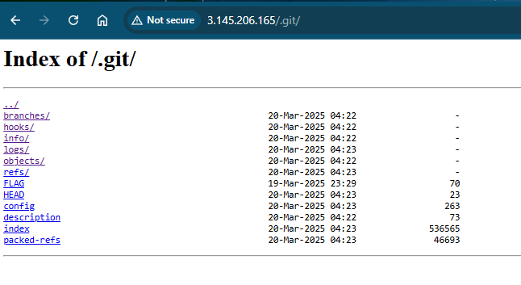
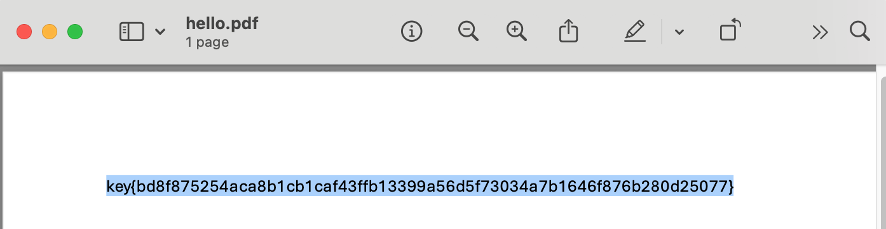

# 2025 CTF Report from Team 22

- Chris Talavera
- Jackson Xu
- Joel Han
- Yucheng Zhang

## Unsolved chanllenges:

- Challenge 4: All your base64 are belong to us.

- Challenge 9: Buried in the dump, redux: needle in the haystack.

- Challenge 13: LOLCAP.

- Challenge 14: notuber.

## Gobuster: Find hidden files and web directories

Gobuster helped us solve several challenges by finding hidden files and directories that we couldn’t see just by browsing the site.

Before we explain how we solved each challenge, we’ll first show Gobuster outputs. These gave us clues like secret admin pages, robots.txt, .git, and cs40 homeworks that led us to the flags.

```
gobuster dir -u http://3.145.206.165 -w /usr/share/wordlists/dirbuster/directory-list-2.3-medium.txt -x php,html,js,json,txt
===============================================================
Gobuster v3.6
by OJ Reeves (@TheColonial) & Christian Mehlmauer (@firefart)
===============================================================
[+] Url:                     http://3.145.206.165
[+] Method:                  GET
[+] Threads:                 10
[+] Wordlist:                /usr/share/wordlists/dirbuster/directory-list-2.3-medium.txt
[+] Negative Status codes:   404
[+] User Agent:              gobuster/3.6
[+] Extensions:              php,html,js,json,txt
[+] Timeout:                 10s
===============================================================
Starting gobuster in directory enumeration mode
===============================================================
/index.php            (Status: 301) [Size: 0] [--> http://3.145.206.165/]
/login.php            (Status: 302) [Size: 0] [--> admin.php?error]
/main.php             (Status: 302) [Size: 0] [--> admin.php]
/data.txt             (Status: 200) [Size: 200701]
/wp-content           (Status: 301) [Size: 169] [--> http://3.145.206.165/wp-content/]
/admin.php            (Status: 200) [Size: 472]
/board.php            (Status: 200) [Size: 1597]
/wp-login.php         (Status: 200) [Size: 5016]
/includes             (Status: 301) [Size: 169] [--> http://3.145.206.165/includes/]
/license.txt          (Status: 200) [Size: 19915]
/wp-includes          (Status: 301) [Size: 169] [--> http://3.145.206.165/wp-includes/]
/logout.php           (Status: 302) [Size: 0] [--> admin.php]
/readme.html          (Status: 200) [Size: 7466]
/robots.txt           (Status: 200) [Size: 8135]
/wp-trackback.php     (Status: 200) [Size: 135]
/scoreboard           (Status: 301) [Size: 169] [--> http://3.145.206.165/scoreboard/]
/wp-admin             (Status: 301) [Size: 169] [--> http://3.145.206.165/wp-admin/]
/xmlrpc.php           (Status: 405) [Size: 42]
/logger.php           (Status: 200) [Size: 99]
/wp-signup.php        (Status: 302) [Size: 0] [--> /wp-login.php?action=register]
Progress: 1323360 / 1323366 (100.00%)
===============================================================
Finished
===============================================================
```

## Challenge 1: ROTten to the Core (Yucheng Zhang).

### Problem

```
Gubfr bs lbh jub ner gnxvat pbzchgre fpvrapr pynffrf va fpubby znl ng guvf
cbvag or guvaxvat, bx, jr’ir tbg guvf fbegrq. Jr’er nyernql orvat gnhtug nyy
nobhg cebtenzzvat. Ohg fbeel, guvf vf abg rabhtu. Lbh unir gb or jbexvat ba
lbhe bja cebwrpgf, abg whfg yrneavat fghss va pynffrf. Lbh pna qb jryy va
pbzchgre fpvrapr pynffrf jvgubhg rire ernyyl yrneavat gb cebtenz. Va snpg
lbh pna tenqhngr jvgu n qrterr va pbzchgre fpvrapr sebz n gbc havirefvgl
naq fgvyy abg or nal tbbq ng cebtenzzvat. Gung’f jul grpu pbzcnavrf nyy
znxr lbh gnxr n pbqvat grfg orsber gurl’yy uver lbh, ertneqyrff bs jurer
lbh jrag gb havirefvgl be ubj jryy lbh qvq gurer. Gurl xabj tenqrf naq
rknz erfhygf cebir abguvat.
xrl{4n247351p63n867os26q505q095p37284rsp3802087onpnp363n418184pp7506}
uggcf://cnhytenunz.pbz/tbbtyr.ugzy
```

### Solution

The code is ROT13-encoded message. I used rot13-decoder (https://cryptii.com/pipes/rot13-decoder) to decode the text, and key `key{4a247351c63a867bf26d505d095c37284efc3802087bacac363a418184cc7506}` is revealed


## Challenge 2: I hope I didn't make this too easy: another flag is on the blog.

### Problem

Xxxxx

### Solution

This is a multi-layer Base64 encoded text. I used the below python script to decode 20 layers to finally got the key `key{5925189030bc2af596c7ccc8d925c292ca0e25165965caba71e9d5fafaebd744}`.

```
import base64

# Read the input
data = open("encoded.txt", "rb").read()

# Try decoding up to 50 layers
for i in range(50):
    try:
        print(f"[+] Decoding layer {i+1}")
        data = base64.b64decode(data)
    except Exception as e:
        print(f"[-] Stopped decoding at layer {i+1}: {e}")
        break

# Save final decoded data
with open("decoded_final.bin", "wb") as f:
    f.write(data)
```

## Challenge 3: .git the FLAG.

### Problem

Find the flag, HINT: .git

### Solution

#### Screenshot of flag


#### Exact Location

FLAG file from http://3.145.206.165/.git/ endpoint



#### Method

Once endpoint was uncovered using brute force adding /.git/ to the url we found a number of files and directories.
One of which was a FLAG file once downloaded and viewed in Notepad exposed the flag. 


## Challenge 5: Don't ask me if something looks wrong. Look again, pay careful attention.

## Challenge 6: Don't ask me if something looks wrong. Look again, pay really careful attention.

## Challenge 7: That readme is peculiar...

## Challenge 8: A whole bunch of CS40 homeworks found



## Challenge 10: About my friend bobo

# 

## Challenge 11: XSS gone sinister.

## Challenge 12: Where are the robots? (Yucheng Zhang)
